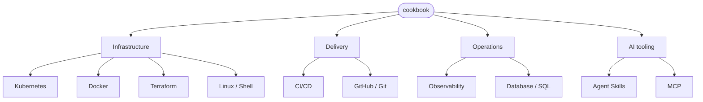

# cookbook

[](https://github.com/xudipta/cookbook/actions/workflows/validate.yml)
[](https://github.com/xudipta/cookbook/actions/workflows/pages.yml)
[](https://xudipta.github.io/cookbook/)

A field guide to infrastructure and AI tooling, written so a newcomer can go from "what
is this" to running it themselves — and so a returning reader can jump straight to the
one command they forgot. Every topic pairs prose notes with a **runnable example**, and
every example is **checked in CI** on every change: linted, schema-validated, or actually
built/applied/deployed against a real target. Nothing here is stale by construction —
if an example stops working, the badge above goes red.

📖 **Browsable docs site: <https://xudipta.github.io/cookbook/>**

## What's here



| Topic | Path | What's validated |
| --- | --- | --- |
| Kubernetes | [`topics/kubernetes/`](topics/kubernetes/README.md) | `yamllint`, `kubeconform`, `helm lint`, `kubectl kustomize`, `kind` deploy + Service curl test |
| Docker / Containers | [`topics/docker/`](topics/docker/README.md) | `hadolint`, live build + run + curl smoke test |
| Terraform / IaC | [`topics/terraform/`](topics/terraform/README.md) | `terraform fmt -check`, `tflint`, live `init`/`apply`/`destroy` |
| Linux / Shell | [`topics/linux/`](topics/linux/README.md) | `shellcheck` on every `*.sh` |
| CI/CD | [`topics/cicd/`](topics/cicd/README.md) | `actionlint` on example workflows |
| GitHub / Git | [`topics/github/`](topics/github/README.md) | `yamllint` on the issue form, `shellcheck` on the `gh` script |
| Observability | [`topics/observability/`](topics/observability/README.md) | `promtool check config`/`rules`, `jq` on the Grafana dashboard |
| Database / SQL | [`topics/database/`](topics/database/README.md) | `sqlfluff lint`, live migrate up+down against real Postgres |
| Agent Skills | [`topics/skills/`](topics/skills/README.md) | `scripts/check_skill.py` on every `SKILL.md` |
| MCP | [`topics/mcp/`](topics/mcp/README.md) | `jq` syntax check on example configs |

Markdown across the whole repo is checked with `markdownlint`. Each topic's own README
has a "New here? Start with..." pointer and a diagram of what the topic actually is —
open one and go.

## Layout

```text
topics/<topic>/
  README.md              # what the topic covers, a diagram, a quickstart, and how it's validated
  notes/NN-*.md          # prose notes, numbered in reading order
  examples/<name>/       # runnable files (manifests, Dockerfiles, scripts, .tf, ...)
```

## How validation works

A single workflow, [`.github/workflows/validate.yml`](https://github.com/xudipta/cookbook/blob/main/.github/workflows/validate.yml), runs
on every push and PR to `main`. A `changes` job detects which topics/file types were
touched and runs only the relevant validators, so a docs-only change doesn't spin up a
`kind` cluster or a Postgres container. `trivy.yml` additionally scans the repo for known
vulnerabilities.

## Docs site

`pages.yml` publishes the topic READMEs and notes to
<https://xudipta.github.io/cookbook/> (MkDocs Material, with Mermaid diagrams rendered
inline) on every push to `main`. `scripts/build_docs.sh` assembles `site-src/` from the
topic tree; `validate.yml` strict-builds it on every docs change.

## Local checks

```bash
make venv       # one-time: create ./venv with the tooling
make lint       # yamllint all YAML
make lint-md    # markdownlint all Markdown (needs npx)
make format     # normalise YAML formatting
make docs-serve # preview the docs site at http://localhost:8000
```

## Adding a topic

See [`CONTRIBUTING.md`](CONTRIBUTING.md).
