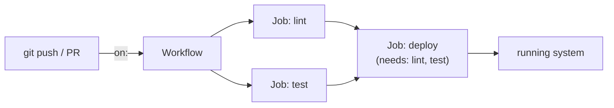

# CI/CD

Notes on pipelines and GitHub Actions, plus reusable workflow examples.

For git itself and GitHub-the-platform (the `gh` CLI, PRs, repo configuration), see
[`topics/github/`](../github/README.md).

## What a pipeline actually does



Every job in a workflow runs on its own fresh runner, in parallel by default — `needs:`
is the only thing that makes one wait for another, which is why `deploy` above only
starts once both `lint` and `test` have passed.

## Contents

- `notes/01-github-actions-basics.md` — workflow anatomy (`on`/`jobs`/`steps`),
  permissions, walking through `examples/workflows/reusable-lint.yml`, security basics.
- `notes/02-workflow-patterns.md` — path filtering, dependency caching, matrix builds,
  reusable workflows vs. composite actions.
- `notes/03-deployment-strategies.md` — rolling, blue-green, and canary deployments,
  environment promotion, and a GitOps overview (with diagrams).
- `examples/workflows/` — example workflow files.

New here? Start with `notes/01-github-actions-basics.md` and read it alongside
`examples/workflows/reusable-lint.yml`.

## Quickstart

Call the example reusable workflow from another workflow in the same repo:

```yaml
jobs:
  lint:
    uses: ./.github/workflows/reusable-lint.yml
    with:
      paths: "."
```

Or check it out and validate it locally the same way CI does:

```bash
actionlint examples/workflows/reusable-lint.yml
```

## Validation

- `yamllint` runs on every `*.yaml`/`*.yml` change (workflow files under
  `.github/workflows/` and `examples/workflows/` are ignored — see `.yamllint.yaml` —
  because Actions expressions trip the linter).
- `actionlint` checks the example workflow files for schema and shell errors.
