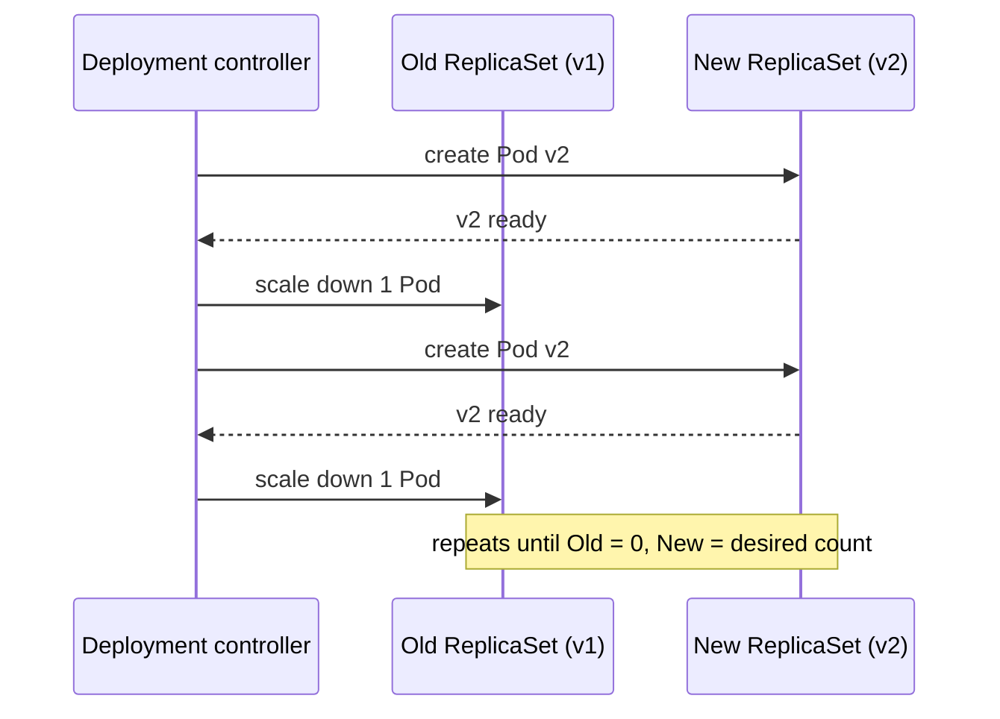
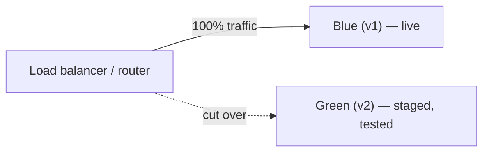
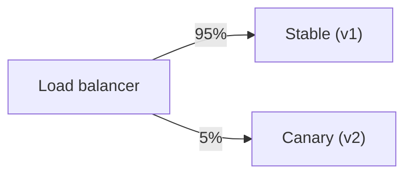
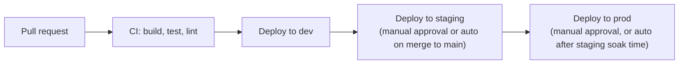
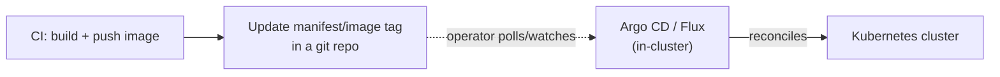

# Deployment strategies

`01-github-actions-basics.md` and `02-workflow-patterns.md` cover the **CI** half —
building, testing, linting. This note covers the **CD** half: how a build actually
reaches production once it's green.

## Rolling deployment

The default in Kubernetes (`kubectl apply` on a changed Deployment — see
`topics/kubernetes/notes/02-pods-and-workloads.md`): new Pods come up and old ones are
scaled down gradually, so there's no all-at-once downtime.

Simple, needs no extra infrastructure, but a bad rollout is only caught mid-flight —
some traffic already hit the broken version. `maxUnavailable`/`maxSurge` on the
Deployment's `strategy.rollingUpdate` control how aggressive the swap is.

## Blue-green deployment

Two full environments exist simultaneously; a router/load balancer flips all traffic
from one to the other at once.

Deploy v2 to Green, run smoke tests against it directly, then flip the router. Rollback
is just flipping the router back — no redeploy needed, which is the main advantage over
rolling. Cost: you run two full environments at once, even if only briefly.

## Canary deployment

A small slice of real traffic is routed to the new version first; the rest keeps going
to the old one. Widen the slice as confidence grows.

Catches problems on real traffic with limited blast radius, at the cost of needing
traffic-splitting infrastructure (a service mesh, an ingress controller that supports
weighted routing, or a feature-flag system) and metrics good enough to judge the canary
before widening it.

## Choosing one

| Strategy | Rollback speed | Infra needed | Blast radius of a bad release |
| --- | --- | --- | --- |
| Rolling | redeploy previous version | none beyond the orchestrator | grows as the rollout proceeds |
| Blue-green | instant (flip router) | 2x environment capacity | 0% until cutover, then 100% |
| Canary | fast (shift weight back to 0%) | weighted routing | small, by design |

## Environments and promotion

A change typically moves through environments in order, each gate adding confidence
before the next:

In GitHub Actions this is usually one `workflow_call`-based deploy job re-used per
environment (see `02-workflow-patterns.md`), gated with `environment:` — which lets you
require manual approval or restrict which secrets a job can see per environment.

## GitOps, briefly

Instead of CI pushing changes directly to the cluster, CI pushes a new image
tag/manifest into a **separate** git repo (or a `kustomize` overlay), and an in-cluster
operator (Argo CD, Flux) continuously reconciles the cluster to match what's in that
repo.

The git repo becomes the single source of truth for "what's running in prod" — an
`apply` never happens from a CI runner's ambient credentials, only from the in-cluster
operator's. Worth reaching for once you have more than one or two people deploying, or
need an audit trail of every change to the cluster's actual state.
