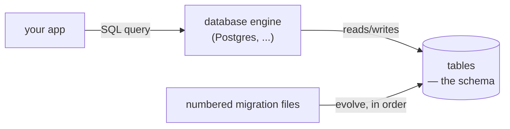

# Database / SQL

Notes and examples for relational schema design, migrations, and querying — provider-
agnostic SQL, Postgres dialect in the examples.

## What holds the data



The schema is never edited by hand once it's live — it only changes through migrations
applied in order, so every environment (your laptop, CI, production) can reach the exact
same schema by replaying the same files. See `02-migrations.md`.

## Contents

- `notes/01-schema-design-and-normalization.md` — 1NF/2NF/3NF, foreign keys and
  constraints, walking through `examples/schema/schema.sql` (with an ER diagram).
- `notes/02-migrations.md` — why migrations instead of hand-editing a schema, up/down
  pairs, running them, how they fit a deploy pipeline — walking through
  `examples/migrations/` (with a diagram).
- `notes/03-queries-and-indexing.md` — what to index and why, `EXPLAIN`, join types, the
  N+1 query problem (with a diagram).
- `examples/schema/schema.sql` — a small, normalized e-commerce schema.
- `examples/migrations/` — that same schema built up as four numbered up/down migration
  pairs.

New here? Start with `notes/01-schema-design-and-normalization.md` alongside
`examples/schema/schema.sql`.

## Quickstart

Needs any running Postgres (`docker run -e POSTGRES_PASSWORD=x -p 5432:5432
postgres:16-alpine` for a disposable local one):

```bash
sqlfluff lint topics/database/examples/           # static check, no database needed

psql -f topics/database/examples/schema/schema.sql
psql -c '\dt'                                      # -> users, products, orders, order_items

psql -c 'DROP TABLE IF EXISTS order_items, orders, products, users CASCADE;'
for f in $(ls topics/database/examples/migrations/*.up.sql | sort); do psql -f "$f"; done
psql -c '\dt'                                      # same 4 tables, built up incrementally
for f in $(ls topics/database/examples/migrations/*.down.sql | sort -r); do psql -f "$f"; done
psql -c '\dt'                                      # -> empty again
```

## Validation

- `sqlfluff lint` (the command above, Postgres dialect configured in `.sqlfluff`) covers
  every `*.sql` file under `examples/`.
- A live check runs the exact Postgres sequence above against a real
  `postgres:16-alpine` service container in CI.
