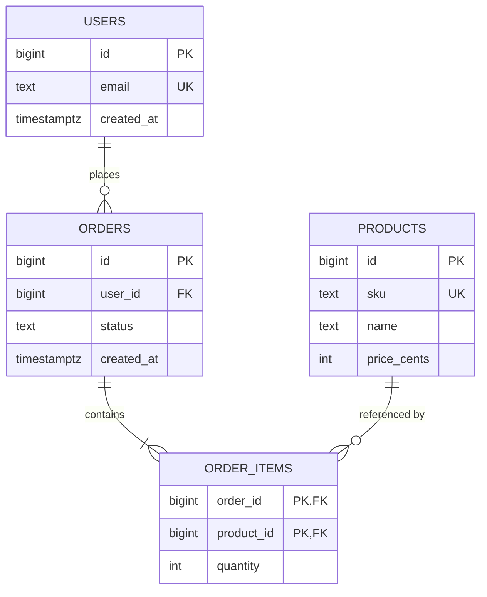

# Schema design and normalization

`examples/schema/schema.sql` is a small e-commerce schema — users place orders, orders
contain line items, line items reference products instead of repeating a product's name
and price on every line:



## Normalization, briefly

Normalization is about eliminating redundancy that could go inconsistent — the classic
progression:

- **1NF** — every column holds one atomic value (no comma-separated lists stuffed into a
  single column).
- **2NF** — every non-key column depends on the *whole* primary key, not part of it.
  Relevant once a table has a composite key, like `order_items` here
  (`(order_id, product_id)`): `quantity` depends on both parts, which is fine; a
  hypothetical `product_name` column on `order_items` would depend on `product_id` alone
  — a 2NF violation, which is exactly why product name lives on `products` instead.
- **3NF** — every non-key column depends on the key and *nothing but* the key (no column
  depends on another non-key column). If `orders` stored `user_email` alongside
  `user_id`, changing a user's email would require updating every one of their past
  orders too — a 3NF violation.

3NF is the practical default for transactional (OLTP) schemas. Deliberately
**denormalizing** — duplicating data for read performance — is a valid, common tradeoff
for reporting/analytics tables, but it's an explicit choice made after 3NF, not a
starting point.

## Reading `schema.sql`

```sql
CREATE TABLE order_items (
    order_id BIGINT NOT NULL REFERENCES orders (id),
    product_id BIGINT NOT NULL REFERENCES products (id),
    quantity INTEGER NOT NULL CHECK (quantity > 0),
    PRIMARY KEY (order_id, product_id)
);
```

- `REFERENCES orders (id)` — a **foreign key**: the database rejects an `order_id` that
  doesn't exist in `orders`, so referential integrity is enforced by the schema, not by
  application code remembering to check.
- `CHECK (quantity > 0)` — a constraint beyond "right type": encodes a business rule
  (can't order zero or negative of something) at the data layer, so it holds no matter
  which application or script writes to the table.
- The composite `PRIMARY KEY (order_id, product_id)` both identifies a row and prevents
  a duplicate line for the same product on the same order — one constraint doing two
  jobs.
- `BIGSERIAL` (Postgres) — an auto-incrementing `BIGINT`; use it (or a UUID) as a
  surrogate key rather than a "natural" key like `email`, so a key never has to change
  because a real-world value changed.

```bash
sqlfluff lint examples/schema/schema.sql   # this repo's own CI check
```
