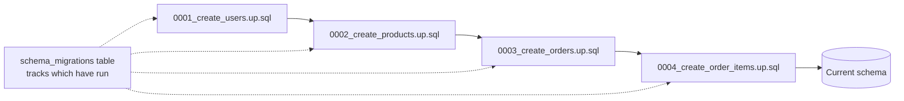

# Migrations

A migration is a small, numbered SQL file that moves the schema from one version to the
next; a migration tool applies them in order and records which ones have run in a
tracking table (`schema_migrations` or similar), so re-running the tool is a no-op for
anything already applied.



`examples/migrations/` builds up `examples/schema/schema.sql` one table at a time, in
dependency order — `0003_create_orders.up.sql` can `REFERENCES users (id)` because
`0001` already ran.

## Why not just hand-edit the schema

- **Reproducibility** — a fresh environment (a new dev's laptop, a CI test database, a
  disaster-recovery restore) gets to the exact same schema by replaying the same
  numbered files, instead of someone remembering every `ALTER TABLE` they ran by hand.
- **Review** — a migration is a diff in a pull request like any other code change,
  reviewable before it touches a real database.
- **Ordering** — numbered/timestamped filenames make the apply order unambiguous, even
  with multiple people adding migrations in parallel branches.

## up/down

```sql
-- 0001_create_users.up.sql
CREATE TABLE users (
    id BIGSERIAL PRIMARY KEY,
    email TEXT NOT NULL UNIQUE,
    created_at TIMESTAMPTZ NOT NULL DEFAULT now()
);
```

```sql
-- 0001_create_users.down.sql
DROP TABLE users;
```

Every `up` gets a matching `down` that reverses it, so a bad migration can be rolled
back without a manual cleanup script. In practice `down` migrations are exercised far
less than `up` (most teams roll forward with a fix instead of rolling back a production
schema change once other migrations depend on it) — but write them anyway; the cost is
small and they're essential in dev/CI where you rebuild the database from scratch often.

## Running them

Tooling differs by ecosystem but the shape is the same — point a CLI at a database URL
and a migrations directory:

```bash
# golang-migrate
migrate -database "$DATABASE_URL" -path examples/migrations up
migrate -database "$DATABASE_URL" -path examples/migrations down 1

# Flyway (Java ecosystem)
flyway -url=$DATABASE_URL migrate

# Alembic (Python/SQLAlchemy)
alembic upgrade head
```

## In CI/CD

A deploy pipeline typically runs migrations as a **separate step before** the new
application version starts (see `topics/cicd/notes/03-deployment-strategies.md` for the
surrounding rollout) — the new code and the new schema need to be compatible for the
window where old and new app versions run side by side during a rolling deploy, which is
why "add a column" is safe to ship in the same release as the code that uses it, but
"drop a column" needs the code stop using it first, in an earlier release.
