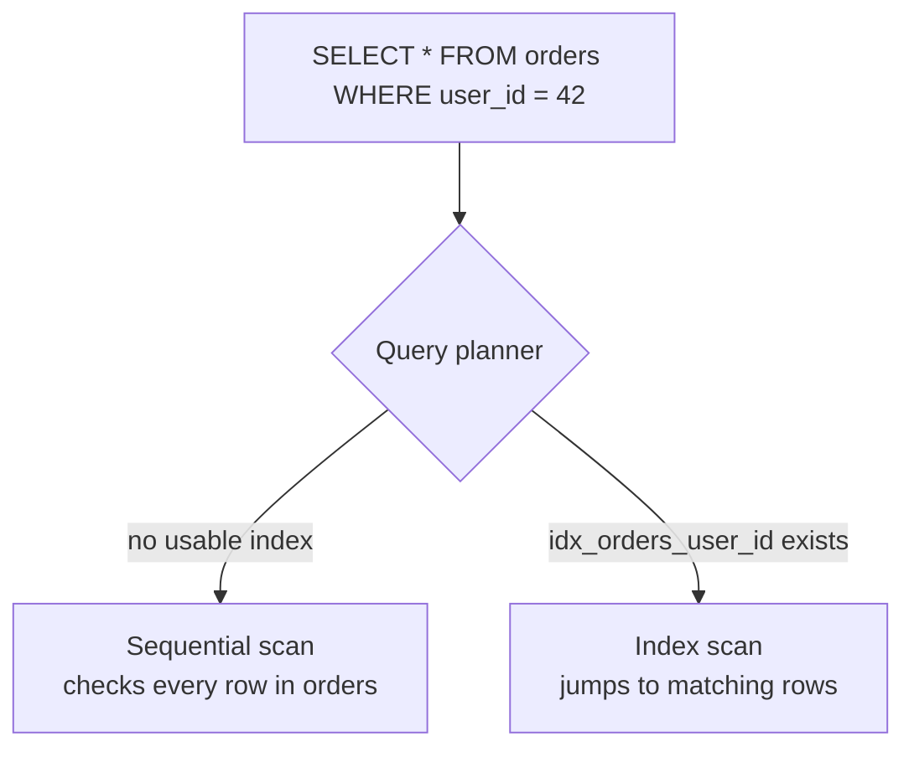

# Queries and indexing

## Why an index

Without an index, finding rows matching a condition means scanning every row (a **seq
scan**). An index on the queried column lets the database jump straight to matching rows
instead.



```sql
CREATE INDEX idx_orders_user_id ON orders (user_id);
```

`examples/schema/schema.sql` adds exactly this index — every `orders` row references a
`user_id`, and "get a user's orders" is the table's most common query shape, so it's the
first index worth adding once the table has enough rows for a seq scan to be slow (on a
tiny table, Postgres's planner may still choose a seq scan — that's correct, not a bug;
indexes have a maintenance cost, so they're not free to add everywhere).

## What to index

- Foreign key columns used in `JOIN`s or `WHERE` clauses (`orders.user_id` above).
- Columns frequently in `WHERE`/`ORDER BY` on a large table.
- A `UNIQUE` constraint (`users.email`, `products.sku` in the example schema) always
  creates an index as a side effect — that's *why* uniqueness checks stay fast as a
  table grows.
- Composite indexes when queries always filter on the same *combination* of columns —
  order matters: an index on `(a, b)` speeds a query filtering on `a` alone or `a AND b`,
  but not one filtering on `b` alone.

Indexing everything isn't free: every index slows down `INSERT`/`UPDATE`/`DELETE`
(the index has to be maintained too) and takes storage. Index based on actual query
patterns, not preemptively.

## EXPLAIN

```sql
EXPLAIN ANALYZE
SELECT * FROM orders WHERE user_id = 42;
```

Shows the planner's actual chosen plan (`Index Scan` vs. `Seq Scan`), estimated vs. real
row counts, and time spent per step — the standard first move when a query is slow,
before guessing at an index or rewriting the query. A `Seq Scan` on a large table where
you expected an `Index Scan` usually means either no matching index exists, or the
planner's statistics are stale (`ANALYZE tablename;` refreshes them).

## Joins

```sql
-- one row per order, only orders that have at least one item
SELECT o.id, oi.product_id, oi.quantity
FROM orders o
JOIN order_items oi ON oi.order_id = o.id;

-- every order, even ones with no items yet (oi columns are NULL for those rows)
SELECT o.id, oi.product_id, oi.quantity
FROM orders o
LEFT JOIN order_items oi ON oi.order_id = o.id;
```

`JOIN` (inner) drops rows with no match on either side; `LEFT JOIN` keeps every row from
the left table regardless of a match. Picking the wrong one is a common source of
"missing rows" bugs — reach for `LEFT JOIN` any time "even if there's nothing on the
other side" is part of the requirement.

## The N+1 query problem

Fetching a list, then querying once per row for related data (e.g. one query for
`orders`, then a separate `SELECT * FROM order_items WHERE order_id = ?` per order in a
loop) turns 1 query into `1 + N`. Fix it with a `JOIN` (above) or a single
`WHERE order_id = ANY($1)` batched query instead of looping — ORMs make N+1 easy to write
by accident via lazy-loaded relations, so it's worth specifically checking for when a
list page feels slow.
