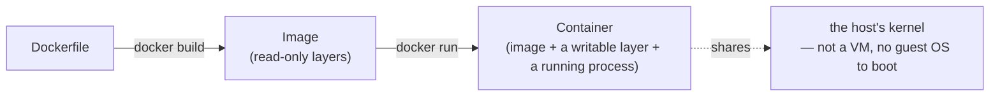

# Docker / Containers

Notes and examples for building and running container images.

## What a container actually is



A container starts in milliseconds because there's no OS to boot — it's an isolated
process on the same kernel as everything else on the host, with its own filesystem view
built from the image's layers plus one writable layer on top.

## Contents

- `notes/01-images-and-dockerfiles.md` — layers, the build cache, Dockerfile best
  practices, walking through `examples/hello-nginx`.
- `notes/02-multi-stage-builds-and-caching.md` — build vs. runtime stages, why the cache
  invalidates, carrying a build cache across CI runs.
- `notes/03-compose-and-networking.md` — `docker compose`, service networking, volumes vs.
  bind mounts.
- `examples/hello-nginx/Dockerfile` — minimal image used to smoke-test the linter.

New to Docker? Start with `notes/01-images-and-dockerfiles.md` and build/run
`examples/hello-nginx` alongside it.

## Quickstart

```bash
docker build -t hello-nginx examples/hello-nginx
docker run -d --name hello-nginx -p 8080:80 hello-nginx
curl http://localhost:8080          # -> "hello from the cookbook"
docker logs hello-nginx              # nginx's access log for that request
docker rm -f hello-nginx             # stop and remove — nothing persists (no volume)
```

## Validation

- `hadolint` lints every `Dockerfile*` under this topic on change:
  `docker run --rm -i hadolint/hadolint < examples/hello-nginx/Dockerfile`.
- A live smoke test runs the exact Quickstart above (build, run, curl, assert on the
  response content) — not just that the Dockerfile is well-formed.
