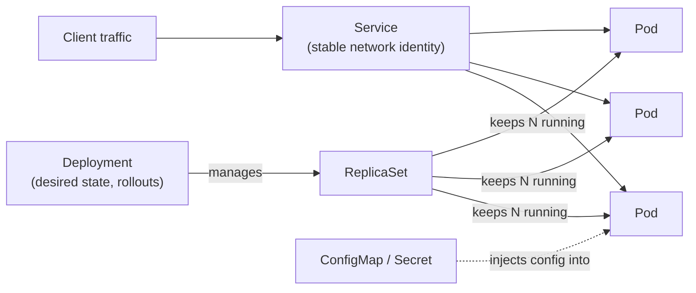

# Kubernetes

Notes and example manifests for core Kubernetes objects and `kubectl` usage.

## What Kubernetes actually does



You declare what you want (a Deployment, N replicas of a container); Kubernetes
continuously reconciles the real cluster to match — recreating a Pod that dies, routing
traffic to whichever Pods are actually healthy via a Service, without you scripting any
of that yourself.

## Contents

- `notes/01-kubectl-commands.md` — create/apply/edit/extract, inspecting and debugging
  with `describe`/`logs`/`exec`, scaling and rollouts, port-forwarding, namespaces.
- `notes/02-pods-and-workloads.md` — Pods vs. ReplicaSets vs. Deployments, how labels and
  selectors tie them together, walking through `examples/pod/`, `examples/replicaset/`,
  and `examples/deployment/sample-deployment.yaml`.
- `notes/03-config-and-secrets.md` — ConfigMap vs. Secret, env vars vs. volume mounts,
  walking through `examples/configs/`, `examples/secrets/`, and the
  `*-with-configmap-secret.yaml` examples.
- `notes/04-services-and-networking.md` — Service types, selectors/endpoints, cluster
  DNS, walking through `examples/services/sample-service.yaml`; Ingress, briefly.
- `notes/05-security-context.md` — Pod- vs. container-level `securityContext`, the fields
  that matter, walking through the `*-with-security-context.yaml` examples.
- `notes/06-helm-and-kustomize.md` — templating + release tracking vs. patch overlays,
  walking through `examples/helm/` and `examples/kustomize/` (with diagrams).
- `examples/pod/` — Pod definitions.
- `examples/deployment/` — Deployment definitions.
- `examples/replicaset/` — ReplicaSet definitions.
- `examples/services/` — Service definitions.
- `examples/configs/` — ConfigMap definitions.
- `examples/secrets/` — Secret definitions.
- `examples/helm/sample-chart/` — a minimal Helm chart.
- `examples/kustomize/` — a `base/` with `dev`/`prod` overlays.

New here? Start with `notes/01-kubectl-commands.md`, then `notes/02-pods-and-workloads.md`
alongside `examples/pod/sample-pod.yaml`.

## Quickstart

Needs any cluster — `kind create cluster` for a disposable local one (exactly what this
repo's own CI uses):

```bash
kubectl apply -f examples/secrets/sample-secret.yaml
kubectl apply -f examples/configs/sample-configmap.yaml
kubectl apply -f examples/deployment/sample-deployment.yaml
kubectl apply -f examples/services/sample-service.yaml

kubectl get pods                     # should show 2 Running nginx pods
kubectl run curl --rm -i --restart=Never --image=curlimages/curl:latest -- \
  curl -s sample-service | grep 'Welcome to nginx'
```

Then poke at it — `kubectl scale deployment/sample-deployment --replicas=1` and watch
`kubectl get endpoints sample-service` shrink to match, or `kubectl delete pod` one of the
two and watch the ReplicaSet replace it.

## Validation

- `yamllint` runs on every `*.yaml` change.
- `kubeconform` schema-validates every manifest under `examples/`, including the
  Deployment/Service rendered from `examples/helm/sample-chart` (`helm template`) and
  from each `examples/kustomize/overlays/*` (`kubectl kustomize`).
- `helm lint` checks `examples/helm/sample-chart`.
- A `kind` cluster applies `secrets/`, `configs/`, `deployment/`, `services/`, waits for
  the Deployment to become available, and curls the Service to confirm nginx responds —
  the exact sequence in the Quickstart above.
