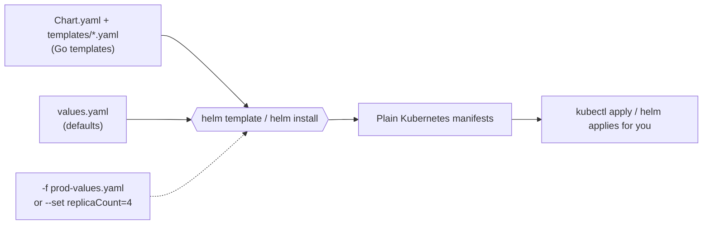
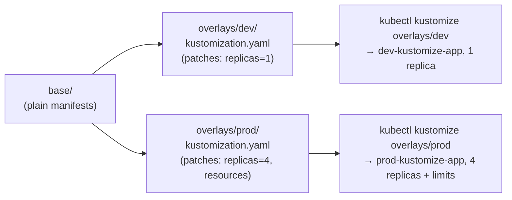

# Helm and Kustomize

Every example so far in this topic is a plain manifest, applied as-is. Once you need the
*same* manifest with small differences per environment (replica count, resource limits,
an image tag), hand-editing YAML per environment doesn't scale — that's what Helm and
Kustomize solve, in two different ways.

## Helm: templating + packaging

A **chart** is a directory of Go-templated manifests plus a `values.yaml` of defaults;
`helm template`/`helm install` renders the templates with a set of values into real
manifests.



```bash
cd examples/helm/sample-chart
helm lint .                          # static checks: required fields, template syntax
helm template my-release .            # render with defaults, print to stdout
helm template my-release . --set replicaCount=4 --set image.tag=1.29
helm install my-release .             # render AND apply, tracked as a "release"
helm upgrade my-release . --set replicaCount=4
helm rollback my-release 1            # back to a previous release revision
helm uninstall my-release
```

`examples/helm/sample-chart` mirrors `examples/deployment/sample-deployment.yaml`, but
`replicaCount`, `image.repository`/`image.tag`, and `service.port` come from
`values.yaml` instead of being hardcoded — read `templates/deployment.yaml` alongside
`values.yaml` to see the `{{ .Values.* }}` substitution.

Helm's extra piece over a plain template engine: **releases**. `helm install`/`upgrade`
tracks what's currently deployed as a named release, so `helm rollback` and `helm
uninstall` know exactly what to undo — plain `kubectl apply` has no equivalent memory.

## Kustomize: overlays, no templating

Kustomize takes the opposite approach: no template syntax at all. A `base/` has plain,
valid manifests; an `overlays/<env>/` references the base and layers **patches** (JSON
Patch or strategic-merge) on top.



```bash
cd examples/kustomize
kubectl kustomize base                  # base alone: 2 replicas, no prefix
kubectl kustomize overlays/dev           # dev-kustomize-app, 1 replica
kubectl kustomize overlays/prod          # prod-kustomize-app, 4 replicas, resource limits added
kubectl apply -k overlays/dev            # -k renders and applies in one step, no separate render+pipe
```

`examples/kustomize/base` is the same Deployment+Service shape as elsewhere in this
topic. `overlays/dev/kustomization.yaml` and `overlays/prod/kustomization.yaml` each
reference `../../base` and apply a JSON Patch (`op: replace` / `op: add`) to change just
what differs — `dev` only overrides replica count; `prod` also adds
`resources.requests`/`limits`, which the base has none of. Both add a `namePrefix` so
`dev-kustomize-app` and `prod-kustomize-app` can coexist in the same namespace.

## Which one

- **Kustomize** — no new templating language, manifests stay plain YAML you can read
  top-to-bottom; built into `kubectl` (`-k`), nothing extra to install. Reach for it when
  differences between environments are structural overrides (replica count, resource
  limits, a namePrefix/namespace).
- **Helm** — needed once you're *distributing* configuration to others (a chart with
  documented `values.yaml`, published to a chart repo) or want release tracking
  (`rollback`, `history`) rather than just "what does `kubectl diff` say changed". Most
  third-party software you install into a cluster (ingress controllers, cert-manager,
  Prometheus — see `topics/observability/`) ships as a Helm chart, so knowing `helm
  install -f values.yaml` is table stakes even if you never author a chart yourself.
- Nothing stops using both: a Kustomize overlay can post-process the output of `helm
  template` for a third-party chart that doesn't expose a value you need.
