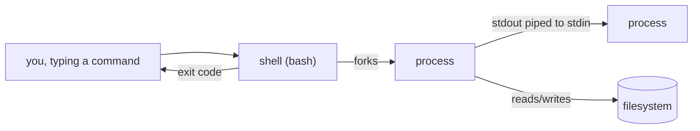

# Linux / Shell

Command references and shell scripts for day-to-day Linux work.

## What the shell is for



The shell's job is to turn a line of text into a running process, wire that process's
input/output to files or other processes (`|`, `>`, `<`), and hand you back an exit code
once it's done — everything in `02-text-processing.md`'s pipelines is just chaining that
one mechanism.

## Contents

- `notes/01-shell-fundamentals.md` — permissions, processes, pipes/redirection, writing
  `set -euo pipefail` scripts, walking through `examples/scripts/backup.sh`.
- `notes/02-text-processing.md` — `grep`, `sed`, `awk`, `find`, chained together.
- `notes/03-systemd-and-networking.md` — managing services with `systemctl`/`journalctl`,
  `ss`/`curl`/`dig`, a troubleshooting checklist.
- `examples/scripts/` — runnable shell scripts, kept `shellcheck`-clean.

New here? Start with `notes/01-shell-fundamentals.md` and run
`examples/scripts/backup.sh` alongside it.

## Quickstart

```bash
mkdir -p /tmp/demo/src && echo "hello" > /tmp/demo/src/file.txt
examples/scripts/backup.sh /tmp/demo/src /tmp/demo/dest
tar -tzf /tmp/demo/dest/src-*.tar.gz    # -> src/, src/file.txt
```

## Validation

`shellcheck` lints every `*.sh` file under `topics/` and `scripts/` on change.

```bash
shellcheck examples/scripts/backup.sh
```
