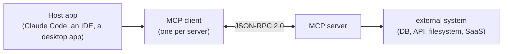

# MCP (Model Context Protocol)

Notes and example configs for **MCP** — the open protocol that lets an AI agent connect to
external tools and data through a uniform interface.

## What MCP connects



One host can run many clients at once, each talking to a different server — that's how
an agent ends up with tools spanning a database, a ticketing system, and your local
filesystem simultaneously, all through the same protocol.

## Contents

- `notes/01-mcp-overview.md` — architecture, transports, and the three primitives.
- `notes/02-mcp-in-claude-code.md` — `.mcp.json`, config scopes, `claude mcp` commands.
- `notes/03-building-a-server.md` — a minimal server and the security checklist.
- `examples/config/` — sample client configuration files.

New here? Start with `notes/01-mcp-overview.md`, then `notes/02-mcp-in-claude-code.md`
alongside `examples/config/.mcp.json`.

## Quickstart

```bash
jq . topics/mcp/examples/config/.mcp.json    # pretty-print + validate a real client config
claude mcp list                               # see it recognized, if you're in Claude Code
```

## Validation

- `markdownlint` covers the notes.
- A `jq` syntax check runs on every JSON file under `examples/` (including the
  dot-prefixed `.mcp.json`).

```bash
find topics/mcp/examples -name '*.json' -o -name '.mcp.json' | xargs -I{} jq empty {}
```
