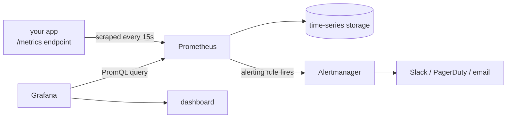

# Observability

Notes and examples for metrics-based observability: Prometheus (scraping, PromQL,
alerting rules) and Grafana (dashboards).

Pairs naturally with [`topics/kubernetes/`](../kubernetes/README.md) (most clusters run a
Prometheus + Grafana stack) but isn't specific to it — the configs here are plain
Prometheus/Grafana, runnable anywhere either is deployed.

## How the pieces fit



Prometheus does two jobs at once: it's both the thing storing your metrics *and* the
thing evaluating alerting rules against them — Grafana and Alertmanager are separate
processes that sit on top, for visualization and notification respectively.

## Contents

- `notes/01-prometheus-basics.md` — pull-based scraping, the four metric types, enough
  PromQL to read a dashboard, recording rules, walking through
  `examples/prometheus/prometheus.yml` (with a diagram).
- `notes/02-alerting-and-rules.md` — anatomy of an alerting rule, what makes a good
  alert, Alertmanager routing, walking through `examples/prometheus/rules.yml` (with a
  diagram).
- `notes/03-grafana-and-dashboards.md` — dashboard JSON structure, provisioning vs.
  manual import, walking through `examples/grafana/dashboard.json` (with a diagram).
- `examples/prometheus/prometheus.yml` — a scrape config.
- `examples/prometheus/rules.yml` — a recording rule and an alerting rule.
- `examples/grafana/dashboard.json` — a two-panel dashboard.

New here? Start with `notes/01-prometheus-basics.md` alongside
`examples/prometheus/prometheus.yml`.

## Quickstart

No live Prometheus needed to check a config is sound — `promtool` parses and validates
it the same way the real server would on startup:

```bash
promtool check config topics/observability/examples/prometheus/prometheus.yml
# Checking .../prometheus.yml
#   SUCCESS: 1 rule files found
#  SUCCESS: .../prometheus.yml is valid prometheus config file syntax

promtool check rules topics/observability/examples/prometheus/rules.yml
# Checking .../rules.yml
#   SUCCESS: 2 rules found
```

## Validation

- `yamllint` covers the Prometheus configs.
- `promtool check config`/`check rules` (the exact commands above) run in CI.
- `jq` syntax-checks `examples/grafana/dashboard.json`.
