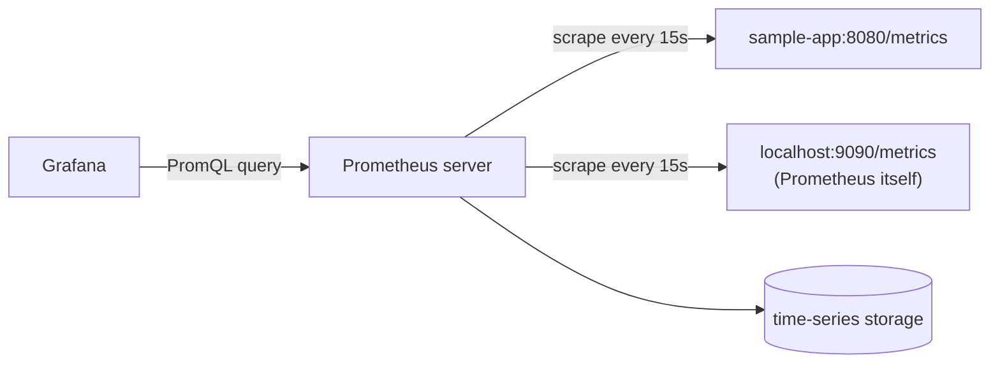

# Prometheus basics

Prometheus is a **pull-based** metrics system: it scrapes an HTTP endpoint on each
target at a fixed interval, rather than targets pushing metrics to it.



## Configuration

```yaml
# examples/prometheus/prometheus.yml
global:
  scrape_interval: 15s
  evaluation_interval: 15s

rule_files:
  - rules.yml

scrape_configs:
  - job_name: sample-app
    metrics_path: /metrics
    static_configs:
      - targets: ["sample-app:8080"]
```

```bash
promtool check config examples/prometheus/prometheus.yml   # syntax + that rule_files resolve
```

- `scrape_interval` — how often Prometheus polls each target.
- `scrape_configs` — one entry per group of targets; `static_configs` is the simplest
  target source (a fixed list). Real deployments usually use **service discovery**
  instead (`kubernetes_sd_configs`, `ec2_sd_configs`, ...) so targets update
  automatically as instances come and go.
- Every target must expose metrics in the Prometheus **exposition format** at
  `metrics_path` (default `/metrics`) — a plain-text list of
  `metric_name{label="value"} value` lines. Client libraries (`prometheus/client_golang`,
  `prometheus_client` for Python, etc.) generate this for you; you rarely hand-write it.

## The four metric types

| Type | Shape | Example |
| --- | --- | --- |
| Counter | only goes up (until a restart resets it to 0) | `http_requests_total` |
| Gauge | goes up or down | `queue_depth`, `memory_usage_bytes` |
| Histogram | buckets of observed values + count/sum | `http_request_duration_seconds` |
| Summary | like a histogram, but quantiles computed client-side | request latency percentiles |

Prefer histograms over summaries when you might want to aggregate across instances —
summary quantiles can't be averaged after the fact; histogram buckets can.

## PromQL, just enough to read a dashboard

```promql
http_requests_total                          # the raw counter, all label combinations
rate(http_requests_total[5m])                 # per-second rate over a 5-minute window — always rate() a counter before graphing it
sum(rate(http_requests_total[5m])) by (job)   # aggregate the rate across instances, grouped by job
histogram_quantile(0.95, rate(http_request_duration_seconds_bucket[5m]))  # p95 latency
```

`rate()` matters: graphing a raw counter shows a line that only goes up and resets to
zero on restart — `rate()` turns it into the per-second value you actually want to look
at.

## Recording rules

A **recording rule** precomputes and stores an expensive/frequent query under a new
metric name, so dashboards and alerts query the cheap precomputed series instead of
recomputing the aggregation every time.

```yaml
# examples/prometheus/rules.yml
groups:
  - name: sample-recording-rules
    rules:
      - record: job:http_requests:rate5m
        expr: sum(rate(http_requests_total[5m])) by (job)
```

```bash
promtool check rules examples/prometheus/rules.yml
```

`job:http_requests:rate5m` follows Prometheus's naming convention for recorded metrics:
`level:metric:operations`. See `02-alerting-and-rules.md` for the alerting half of this
same file.
