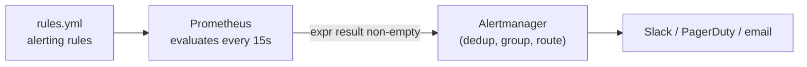

# Alerting and rules

Prometheus evaluates alerting rules on the same schedule as recording rules
(`evaluation_interval`), but instead of storing a new metric, a rule whose expression
returns any results becomes a **firing alert** — which Prometheus pushes to Alertmanager,
a separate process that handles routing, deduplication, and notification.



## Anatomy of an alerting rule

```yaml
# examples/prometheus/rules.yml
- alert: HighErrorRate
  expr: job:http_requests:rate5m{job="sample-app"} > 100
  for: 5m
  labels:
    severity: warning
  annotations:
    summary: "High request rate on {{ $labels.job }}"
    description: "sample-app request rate has been above 100/s for 5 minutes."
```

- `expr` — any PromQL expression; the alert fires for every distinct label combination
  the expression returns, not just once.
- `for: 5m` — the condition must stay true for this long before the alert actually
  fires (state goes `pending` → `firing`). Without `for`, a single noisy scrape fires an
  alert — this is the single most common cause of alert fatigue, and the fix is almost
  always adding or lengthening `for`, not deleting the alert.
- `labels` — used by Alertmanager for routing (`severity: critical` → page; `severity:
  warning` → Slack channel) and grouping.
- `annotations` — human-readable text shown in the notification; `{{ $labels.job }}`
  templates in the label values from the specific series that fired.

```bash
promtool check rules examples/prometheus/rules.yml
promtool test rules alert_tests.yml   # unit-test rules against synthetic input series (not included here)
```

## What makes a good alert

- **Alert on symptoms, not causes** — "error rate > 1%" (a symptom users feel), not "CPU
  > 80%" (a cause that may or may not actually be hurting anyone). A cause-based alert
  without user impact just trains people to ignore pages.
- **Every alert should be actionable** — if firing it doesn't lead to a specific action,
  it belongs on a dashboard, not in `alertmanager`.
- **Route by severity, not by team guesswork** — `critical` pages someone now; `warning`
  can wait for business hours in a Slack channel. Encode that in `labels.severity` and
  let Alertmanager's routing tree do the rest.

## Alertmanager routing, briefly

```yaml
route:
  receiver: slack-default
  group_by: [alertname, job]
  routes:
    - match:
        severity: critical
      receiver: pagerduty
receivers:
  - name: slack-default
    slack_configs:
      - channel: "#alerts"
  - name: pagerduty
    pagerduty_configs:
      - service_key: "<key>"
```

`group_by` batches related alerts (e.g. the same `alertname` firing across many
instances) into one notification instead of one per series — without it, a single bad
deploy can page someone 50 times in a minute.
