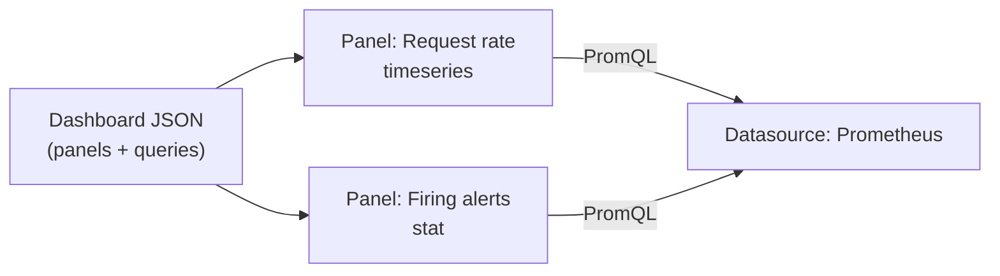

# Grafana and dashboards

Grafana queries one or more **datasources** (Prometheus among many others) and renders
the results as panels on a dashboard. A dashboard is just JSON — you can hand-edit it,
generate it, or version it in git, all shown in `examples/grafana/dashboard.json`.



## Anatomy of `examples/grafana/dashboard.json`

```json
{
  "title": "Sample App Overview",
  "uid": "sample-app-overview",
  "schemaVersion": 39,
  "panels": [
    {
      "id": 1,
      "title": "Request rate",
      "type": "timeseries",
      "datasource": { "type": "prometheus", "uid": "prometheus" },
      "targets": [
        { "expr": "job:http_requests:rate5m", "refId": "A" }
      ]
    }
  ]
}
```

- `uid` — the stable identifier used in the dashboard's URL; keep it fixed once set so
  bookmarks/links don't break on re-import.
- `schemaVersion` — Grafana's dashboard schema version; Grafana migrates older schemas
  on import, but pin a current one for new dashboards.
- Each `panels[]` entry is one visualization: a `type` (`timeseries`, `stat`, `table`,
  `gauge`, ...), a `datasource`, and one or more `targets` — each target's `expr` is a
  query in that datasource's language (PromQL here; see `01-prometheus-basics.md`).
  `refId` distinguishes multiple queries feeding the same panel (e.g. one line per
  series in a legend).

```bash
jq empty examples/grafana/dashboard.json    # syntax check — this repo's own CI does exactly this
```

## Getting a dashboard in and out of Grafana

```bash
# import via UI: Dashboards → New → Import → paste the JSON
# or via API:
curl -X POST http://grafana:3000/api/dashboards/db \
  -H "Content-Type: application/json" \
  -d @examples/grafana/dashboard.json
```

For anything beyond a one-off dashboard, use **provisioning** instead of manual
import/export: a `provisioning/dashboards/*.yaml` config tells Grafana to load
dashboard JSON files from a directory on startup, so the dashboard is defined in git
(this repo's `examples/grafana/dashboard.json` is exactly the kind of file that config
would point at) and reproducible across environments without click-ops.

## Alerting overlap

Grafana can also evaluate alert rules directly (Grafana-managed alerting) as an
alternative to Prometheus's own alerting rules (`02-alerting-and-rules.md`). Prefer
Prometheus alerting rules when Prometheus is already your source of truth for
metrics — one less place for the same logic to live; reach for Grafana-managed alerting
mainly when a datasource other than Prometheus needs alerting too.
