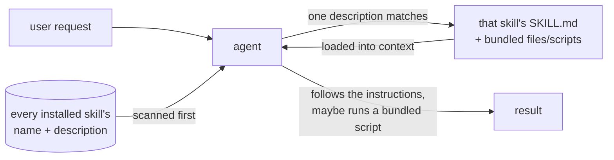

# Agent Skills

Notes and examples for **Agent Skills** — folders of instructions (and optional scripts /
resources) that an AI agent loads on demand to do a specific kind of task well.

## How a skill gets used



Only names and descriptions are scanned up front — cheap, so having many installed
skills costs little. A skill's full body (and any bundled script) loads only once the
agent decides it's actually relevant, which is why the `description` field is what
authoring a skill is really about getting right (see `02-authoring-skills.md`).

## Contents

- `notes/01-what-are-agent-skills.md` — the concept and when to reach for one.
- `notes/02-authoring-skills.md` — the `SKILL.md` format, frontmatter, and bundled files.
- `notes/03-skills-in-claude-code.md` — how Claude Code discovers, gates, and invokes skills.
- `examples/pdf-summary/` — a minimal skill (instructions only).
- `examples/release-notes/` — a skill that bundles a helper script.

New here? Start with `notes/01-what-are-agent-skills.md`, then read
`examples/pdf-summary/SKILL.md` — it's short enough to read in one pass.

## Quickstart

```bash
python scripts/check_skill.py topics/skills/examples/pdf-summary/SKILL.md
# ok   topics/skills/examples/pdf-summary/SKILL.md
```

That's the same check CI runs on every `SKILL.md` — a useful sanity check to run on any
new skill you author, before installing it anywhere.

## Validation

- `markdownlint` covers the notes.
- `scripts/check_skill.py` validates every `examples/**/SKILL.md`: frontmatter present,
  `name` is kebab-case ≤ 64 chars and matches the folder, `description` present ≤ 1024
  chars, and a non-empty body.

```bash
python scripts/check_skill.py topics/skills/examples/*/SKILL.md
```
