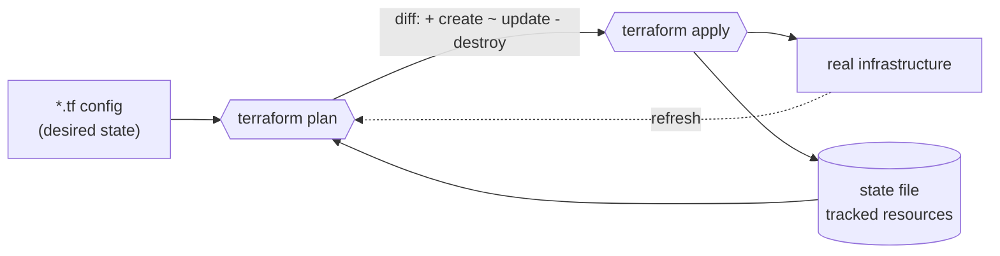

# Terraform / IaC

Infrastructure-as-code notes and self-contained examples.

## What Terraform actually does



`plan` is the whole point: it diffs your config against the state file (which itself
gets refreshed against real infrastructure first) and shows exactly what `apply` would
change, before anything happens.

## Contents

- `notes/01-core-workflow.md` — `init`/`plan`/`apply`/`destroy`, reading a plan, how state
  tracks resources, walking through `examples/local-file`.
- `notes/02-variables-and-modules.md` — setting variables, outputs, extracting a module.
- `notes/03-state-and-workspaces.md` — remote backends, state locking, workspaces vs.
  per-environment directories.
- `examples/local-file/` — a credential-free example using the `hashicorp/local` provider.

New to Terraform? Start with `notes/01-core-workflow.md` and run `examples/local-file`
alongside it.

## Quickstart

```bash
cd examples/local-file
terraform init
terraform apply -auto-approve
cat greeting.txt                     # -> hello from the cookbook
terraform apply -auto-approve -var 'greeting=hi there'   # re-plan: ~ update in place
cat greeting.txt                     # -> hi there
terraform destroy -auto-approve
```

## Validation

A fast static job runs first, without `terraform init` or provider downloads:

```bash
terraform fmt -check -recursive .
tflint --recursive
```

A separate, slower job then actually runs the Quickstart above end to end — `init`,
`apply`, checks `greeting.txt` has the expected content, then `destroy` — catching
anything the static checks can't (a provider version that no longer resolves, a resource
attribute renamed upstream).

Examples must be formatted and free of `tflint` warnings. Prefer providers that need no
cloud credentials (`local`, `random`, `null`, `tls`) so examples stay runnable anywhere.
